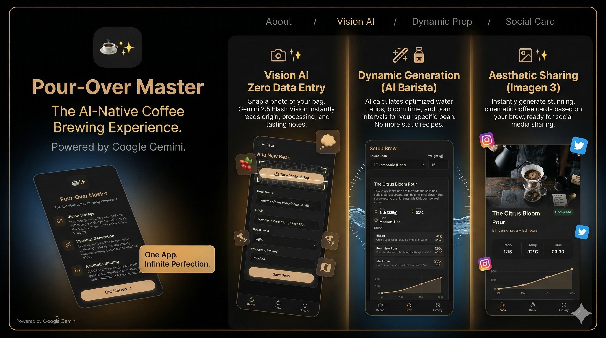

# Pour-Over Master ☕️✨

<div align="center">
  
</div>

**Pour-Over Master** is not just another coffee timer. It is a next-generation, AI-native Progressive Web App (PWA) designed to completely reimagine the pour-over coffee experience for modern baristas and coffee enthusiasts.

## 🌟 Why is it different? (The "AI-First" Approach)

Traditional pour-over apps (like *Filtru*, *Brew*, or *Acaia*) operate on a **static library model**: you search a massive database of community recipes, pick one, and follow the timer. 

**Pour-Over Master flips this paradigm using Google Gemini AI:**

1. **Zero Data Entry (Vision AI):** Instead of typing out origin and processing details, simply **take a photo** of your coffee bean bag. Gemini reads the label and extracts the roast level, tasting notes, origin, and a starter recipe formula.
2. **Generative Recipes:** You don't search for recipes anymore. The AI acts as a digital World Barista Champion. Based on the specific density and solubility characteristics of your bean (e.g., Light Roast Washed Ethiopian vs. Dark Roast Natural Brazilian), the AI **generates a mathematically optimized recipe formula on the fly**—calculating the perfect bloom time, water ratios, and pouring intervals.
3. **Aesthetic Sharing:** After a successful brew, the app uses Gemini Imagen 3 to generate a dreamy, ethereal watercolor painting inspired by the tasting notes of your coffee, creating an abstract and artistic "Coffee Card" ready for social media sharing.

## 🚀 Key Features

- **AI Bean Recognition:** One-click camera integration to digitize your coffee bean collection.
- **Auto-Calculated Brew Formulas:** Dynamic recipe generation that adapts to your specific dose (e.g., 15g vs 20g) while maintaining fluid dynamics integrity.
- **Smart Brewing HUD:** A hyper-focused, distraction-free visual timer that guides your pours second-by-second.
- **Visual Analytics:** Beautiful, interactive brew charts (Chart.js) for recipes and share cards.
- **Secure Architecture:** Frontend built with Vite + React + TypeScript, backed by **Vercel Serverless Functions** to keep your AI Prompts and API Keys strictly server-side.
- **Offline First (PWA):** Installs directly to your iOS/Android home screen. All bean data and brewing history are kept locally on your device via IndexedDB (`localforage`).

## 🛠 Tech Stack

- **Frontend:** React 19, TypeScript, Vite
- **Styling:** Vanilla CSS (Glassmorphism UI, Dark Theme)
- **Data Persistence:** IndexedDB via `localforage`
- **PWA Capabilities:** `vite-plugin-pwa` (Service Workers, Manifest, Auto-Updates)
- **AI Engine:** Google Gemini SDK (`gemini-3.1-flash-lite-preview` for recognition/recipe text, `gemini-3.1-flash-image-preview` for image generation)
- **Backend / Deployment:** Vercel Serverless Functions (`api/` directory)

## 💻 Local Development

1. **Clone the repository and install dependencies:**
   ```bash
   npm install
   ```

2. **Configure Environment Variables:**
   Rename `.env.example` to `.env` and add your Google Gemini API key:
   ```env
   GEMINI_API_KEY=your_gemini_api_key_here
   ```

3. **Start the local dev server:**

   **Option A: Vite only**
   ```bash
   npm run dev
   ```
   This is useful for UI work, but `/api` requests are proxied to `http://localhost:3000`, so AI features will not work unless you also run the Vercel dev server.

   *App available at `http://localhost:5173`*

   **Option B: Vercel CLI (Full stack with AI features)**
   ```bash
   # Install Vercel CLI globally if you haven't already
   npm i -g vercel

   # Log in if needed
   vercel login

   # Start the combined Frontend + Serverless Backend
   npm run dev:vercel
   ```
   *App available at `http://localhost:3000`*

## Notes on Runtime Behavior

- The mobile app is the primary experience. Desktop visitors are shown a landing page with a QR code that points them back to the mobile app.
- Brewing data, beans, onboarding state, install prompt dismissal, and the client-side AI rate limit are stored locally in IndexedDB via `localforage`.
- The app includes a development-only **Test Mode** on the Brew page for a 10-second brew cycle to speed up UI and share-flow testing.

## 📱 Installation on Mobile (PWA)

1. Open the deployed Vercel URL in Safari (iOS) or Chrome (Android).
2. Tap the **"Share"** icon (iOS) or the **"Three Dots"** menu (Android).
3. Select **"Add to Home Screen"**.
4. The app will install locally and can be launched in full-screen mode like a native app.
